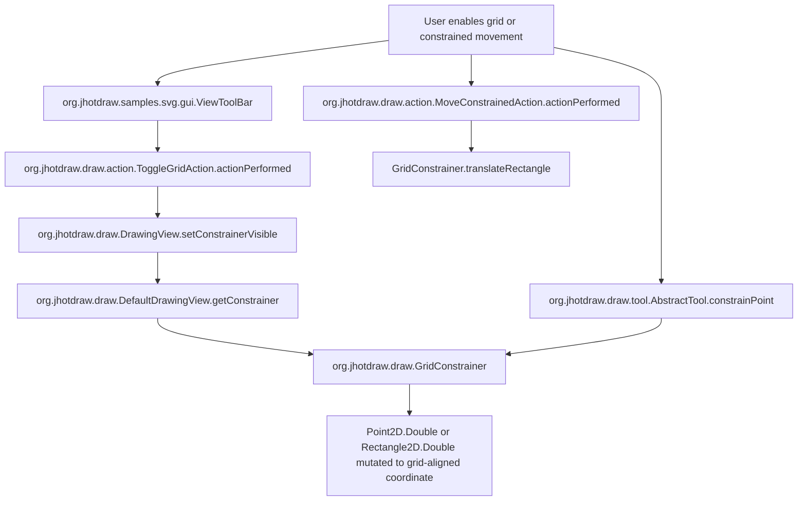

# Feature Call Tree - Snap-to-grid / constrained movement

| Step | Caller | Method | Callee | Purpose |
| ---: | --- | --- | --- | --- |
| 1 | `ViewToolBar` | `createDisclosedComponent` | `ButtonFactory.createToggleGridButton` | Exposes grid toggle and grid size in SVG UI. |
| 2 | `ToggleGridAction` | `actionPerformed` | `DrawingView.setConstrainerVisible` | Toggles visible grid constrainer. |
| 3 | `DefaultDrawingView` | `getConstrainer` | `GridConstrainer` | Selects visible or invisible constrainer. |
| 4 | `AbstractTool` | `constrainPoint` | `Constrainer.constrainPoint` | Applies snapping during mouse-based editing. |
| 5 | `MoveConstrainedAction` | `actionPerformed` | `Constrainer.translateRectangle` | Moves selection by one constrained unit. |
| 6 | `GridConstrainer` | `constrainPoint` | `Point2D.Double` | Snaps point coordinates. |
| 7 | `GridConstrainer` | `constrainRectangle` | `Rectangle2D.Double` | Moves nearest rectangle edge to grid. |
| 8 | `GridConstrainer` | `constrainAngle` | `double` | Snaps rotation to theta step. |

Scope count: 5 packages, 8 classes/interfaces, 10 methods.
