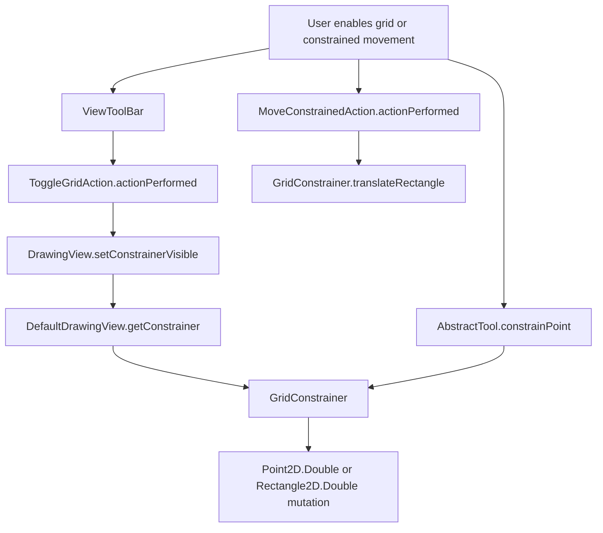
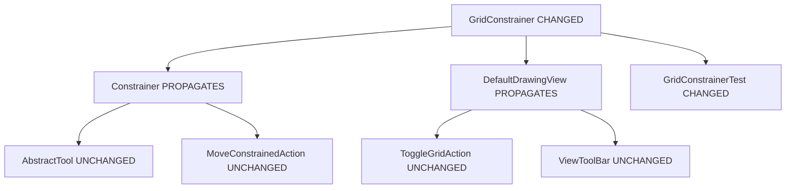

# Portfolio: Snap-to-grid / constrained movement

Project: https://github.com/SP-SDU/JHotDraw.git
Date: 2026-06-11

---

## 1. Introduction and Baseline Setup

### 1.1 Purpose

This portfolio follows existing JHotDraw feature `Snap-to-grid / constrained movement` through Rajlich-style software maintenance phases: change request, concept location, impact analysis, actualization, refactoring, verification, and BDD testing.

Selected feature connects directly to drawing precision. User enables or uses grid constraints, then JHotDraw aligns points, rectangles, movements, and rotations through `org.jhotdraw.draw.GridConstrainer`.

### 1.2 Repository Setup

| Item | Value |
| --- | --- |
| Repository path | `C:\Users\User\source\repos\JHotDraw` |
| Fork URL | `https://github.com/SP-SDU/JHotDraw.git` |
| Upstream URL | `https://github.com/sweat-tek/JHotDraw.git` |
| Feature branch | `feature/snap-to-grid-portfolio` |
| JDK version | OpenJDK `23.0.2` locally; CI workflow uses JDK11 as lab target |
| Maven version | Apache Maven `3.9.9` |
| Build command | `mvn clean install -DskipTests` |
| Run command | `mvn exec:java "-Dexec.mainClass=org.jhotdraw.samples.svg.Main"` in `jhotdraw-samples/jhotdraw-samples-misc` |

Required build command:

```powershell
mvn clean install -DskipTests
```

Output summary:

```text
[INFO] Reactor Summary for jhotdraw 9.1-SNAPSHOT:
[INFO] jhotdraw ........................................... SUCCESS
[INFO] jhotdraw-api ....................................... SUCCESS
[INFO] jhotdraw-utils ..................................... SUCCESS
[INFO] jhotdraw-xml ....................................... SUCCESS
[INFO] jhotdraw-datatransfer .............................. SUCCESS
[INFO] jhotdraw-actions ................................... SUCCESS
[INFO] jhotdraw-core ...................................... SUCCESS
[INFO] jhotdraw-gui ....................................... SUCCESS
[INFO] jhotdraw-app ....................................... SUCCESS
[INFO] jhotdraw-samples ................................... SUCCESS
[INFO] jhotdraw-samples-misc .............................. SUCCESS
[INFO] jhotdraw-samples-mini .............................. SUCCESS
[INFO] BUILD SUCCESS
```

Required run command:

```powershell
cd jhotdraw-samples/jhotdraw-samples-misc
mvn exec:java "-Dexec.mainClass=org.jhotdraw.samples.svg.Main"
```

Output proof:

```text
[INFO] --- exec:3.1.0:java (default-cli) @ jhotdraw-samples-misc ---
Warning ResourceBundleUtil[org.jhotdraw.app.Labels].getIconProperty "application.about.icon" not found.
Warning ResourceBundleUtil[org.jhotdraw.draw.Labels].getIconProperty "edit.moveConstrainedEast.icon" not found.
Warning ResourceBundleUtil[org.jhotdraw.draw.Labels].getIconProperty "edit.moveConstrainedWest.icon" not found.
Warning ResourceBundleUtil[org.jhotdraw.draw.Labels].getIconProperty "edit.moveConstrainedNorth.icon" not found.
Warning ResourceBundleUtil[org.jhotdraw.draw.Labels].getIconProperty "edit.moveConstrainedSouth.icon" not found.
Process exceeded 20000 ms timeout because Swing GUI stays open.
```

### 1.3 Baseline Result

Build succeeded. SVG application reached Swing action/resource initialization and stayed open until timeout, which is expected for GUI process.

Lab review: IntroLab met with build, run command, branch, Maven/JDK evidence. KISS kept setup changes separate from feature logic.

---

## 2. Change Request

### 2.1 Requested Feature

Requested feature:
- `Snap-to-grid / constrained movement`

### 2.2 Contained Subfeatures

Contained subfeatures:
- Point snapping to nearest grid intersection.
- Rectangle placement by nearest edge to grid.
- Directional movement by constrained grid unit.
- Rotation angle snapping by configured theta.
- Visible grid toggle and grid-size UI in SVG sample.

### 2.3 User Story

As a `drawing user`, I want `snap-to-grid and constrained movement`, so that `I can place figures with consistent alignment`.

### 2.4 Details / Functional Requirements

| Requirement | Behavior |
| --- | --- |
| User can toggle grid | `ToggleGridAction.actionPerformed` calls `DrawingView.setConstrainerVisible`. |
| User can set grid size | `ViewToolBar` updates `GridConstrainer.setWidth` and `setHeight`. |
| Selected objects affected | Points, figure bounds, rectangles, and rotation operations routed through `Constrainer`. |
| Expected result | Coordinates align to configured grid size or theta. |
| Edge case | `rotateAngle` rejects `null` `RotationDirection` with `IllegalArgumentException`. |
| Edge case | Directional point translation east changes x coordinate but preserves y coordinate. |

### 2.5 Acceptance Criteria

| ID | Given | When | Then |
| --- | --- | --- | --- |
| AC-1 | `point 14,13 and grid 10 by 5` | `constrainPoint` runs | `point becomes 10,15` |
| AC-2 | `rectangle 13,26,12,8 and grid 10 by 10` | `constrainRectangle` runs | `rectangle moves to 10,22 without resizing` |
| AC-3 | `point 13,26 and grid 10 by 10` | `translatePoint EAST` runs | `point becomes 20,26` |
| AC-4 | `angle 0.70 and theta pi/4` | `constrainAngle` runs | `angle becomes pi/4` |
| AC-5 | `null rotation direction` | `rotateAngle` runs | `IllegalArgumentException` is captured |

Lab review: ChangeReqLab met with selected existing JHotDraw feature, user story, requirements, and acceptance criteria. KISS scope excludes new user-facing behavior.

---

## 3. Continuous Integration

### 3.1 CI Purpose

CI fits this repository because JHotDraw is a Maven multi-module project. Pull requests should build all modules and run tests automatically so integration errors appear before merge.

### 3.2 GitHub Actions Workflow

File: `.github/workflows/maven.yml`

```yaml
name: Maven CI

on:
  pull_request:
  push:
    branches:
      - develop
      - main

jobs:
  build:
    runs-on: ubuntu-latest

    steps:
      - name: Checkout repository
        uses: actions/checkout@v4

      - name: Set up JDK 11
        uses: actions/setup-java@v4
        with:
          distribution: temurin
          java-version: '11'
          cache: maven

      - name: Build with Maven
        run: mvn -B clean install -DskipTests

      - name: Run tests
        run: mvn -B test
```

### 3.3 CI Result

| Item | Value |
| --- | --- |
| Trigger | Pull request and pushes to `develop` or `main`. |
| Build command | `mvn -B clean install -DskipTests` |
| Test command | `mvn -B test` |
| Local equivalent result | `mvn test` succeeded with all modules green. |
| Remote workflow result | No run found by `gh run list --branch feature/snap-to-grid-portfolio --limit 5`; local equivalent passed. |

Lab review: CILab met by adding Maven GitHub Actions workflow and local verification commands. KISS uses one workflow and no repository secrets because current dependency resolution works without `.maven-settings.xml` locally.

---

## 4. Concept Location

### 4.1 Method

Concept location used static search, call-chain inspection, and runtime launch of the SVG sample. Search terms included `GridConstrainer`, `getConstrainer`, `setConstrainerVisible`, `ToggleGridAction`, and `MoveConstrainedAction`. Runtime action is SVG app startup with grid-related actions loaded.

Concept Triangle framing: concept name is `snap-to-grid / constrained movement`, observable behavior is grid-aligned coordinates, and code locus is `org.jhotdraw.draw.GridConstrainer`.

No IDE debugger screenshot is included. Instead, portfolio uses exact classes, methods, source paths, and local runtime command evidence. This is weaker than a debugger screenshot, but still gives reproducible concept-location evidence.

### 4.2 Triggering User Action

Feature can be triggered by selecting drawing objects and using constrained movement actions such as `edit.moveConstrainedEast`, or by toggling grid visibility through SVG toolbar button created by `ButtonFactory.createToggleGridButton(view)`.

### 4.3 Initial Concept Classes

| Domain Class | Package | How Found | Responsibility |
| --- | --- | --- | --- |
| `GridConstrainer` | `org.jhotdraw.draw` | Search, call hierarchy, tests | Implements grid snap and rotation constraints. |
| `Constrainer` | `org.jhotdraw.draw` | `DrawingView.getConstrainer` contract | Strategy interface for editing constraints. |
| `DrawingView` | `org.jhotdraw.draw` | Grid visibility and constrainer accessors | View-level owner of current constrainer. |
| `DefaultDrawingView` | `org.jhotdraw.draw` | Implementation of `DrawingView` | Returns visible or invisible constrainer. |
| `ToggleGridAction` | `org.jhotdraw.draw.action` | Grid action search | Toggles visible constrainer. |
| `MoveConstrainedAction` | `org.jhotdraw.draw.action` | Constrained movement search | Moves selection by constrained unit. |
| `AbstractTool` | `org.jhotdraw.draw.tool` | `constrainPoint` call | Delegates mouse coordinates to current constrainer. |
| `ViewToolBar` | `org.jhotdraw.samples.svg.gui` | SVG toolbar path | Exposes grid UI controls. |
| `SVGApplicationModel` | `org.jhotdraw.samples.svg` | SVG startup path | Creates default `GridConstrainer(12, 12)`. |

### 4.4 Concept Location Summary

Entry point for runtime GUI is `org.jhotdraw.samples.svg.Main`, which uses SVG application model and view UI. Domain center is `GridConstrainer`. UI classes are `ViewToolBar` and `ToggleGridAction`. Model/data classes are `Point2D.Double`, `Rectangle2D.Double`, and drawing figures reached through `DrawingView` and tools.

Classes excluded: figure subclasses such as `RectangleFigure` and `EllipseFigure`, because snapping mutates geometric coordinates through constrainer logic and does not depend on concrete figure type.

Lab review: CLLab met by listing exact concept classes and responsibilities. KISS keeps concept set limited to classes that participate in selected feature.

---

## 5. Feature Call Tree / Interaction View

### 5.1 Call Tree



### 5.2 Important Calls

| Step | Caller | Method | Callee | Purpose |
| ---: | --- | --- | --- | --- |
| 1 | `ViewToolBar` | `createDisclosedComponent` | `ButtonFactory.createToggleGridButton` | Creates toolbar UI for grid. |
| 2 | `ToggleGridAction` | `actionPerformed` | `DrawingView.setConstrainerVisible` | Turns visible grid constrainer on or off. |
| 3 | `DefaultDrawingView` | `getConstrainer` | `GridConstrainer` | Resolves current constrainer. |
| 4 | `AbstractTool` | `constrainPoint` | `Constrainer.constrainPoint` | Applies grid snapping during mouse editing. |
| 5 | `MoveConstrainedAction` | `actionPerformed` | `Constrainer.translateRectangle` | Applies constrained keyboard movement. |
| 6 | `GridConstrainer` | `constrainPoint` | `Point2D.Double` | Snaps point coordinates. |
| 7 | `GridConstrainer` | `constrainRectangle` | `Rectangle2D.Double` | Aligns rectangle edge to grid. |

### 5.3 Scope Count

Feature call tree spans `5` packages, `8` classes/interfaces, and `10` relevant methods.

### 5.4 Interpretation

Central classes are `GridConstrainer`, `Constrainer`, and `DrawingView`. Incidental classes are SVG toolbar and actions because they trigger or expose feature but do not define snapping math.

Lab review: Call tree met using small static/runtime path. KISS avoids tracing unrelated figure rendering and persistence classes.

---

## 6. Impact Analysis

### 6.1 Impact Analysis Method

Starting point was `GridConstrainer`. Neighbors were classified using Rajlich-style impact marks: `CHANGED`, `NEXT`, `PROPAGATES`, `UNCHANGED`, and `BLANK`. Because public method signatures stayed unchanged, only implementation and tests needed modification.

### 6.2 Impact Diagram



### 6.3 Estimated Impact Set

| Class | Package | Mark | Reason |
| --- | --- | --- | --- |
| `GridConstrainer` | `org.jhotdraw.draw` | CHANGED | Extracted coordinate snapping helper. |
| `GridConstrainerTest` | `org.jhotdraw.draw` | CHANGED | Added unit and BDD coverage. |
| `Constrainer` | `org.jhotdraw.draw` | PROPAGATES | Public contract unchanged. |
| `DrawingView` | `org.jhotdraw.draw` | PROPAGATES | Exposes current constrainer. |
| `DefaultDrawingView` | `org.jhotdraw.draw` | PROPAGATES | Holds and returns `GridConstrainer`. |
| `MoveConstrainedAction` | `org.jhotdraw.draw.action` | UNCHANGED | Uses existing API. |
| `ToggleGridAction` | `org.jhotdraw.draw.action` | UNCHANGED | Toggle behavior unchanged. |
| `AbstractTool` | `org.jhotdraw.draw.tool` | UNCHANGED | Delegation unchanged. |
| `ViewToolBar` | `org.jhotdraw.samples.svg.gui` | UNCHANGED | UI contract unchanged. |
| `SVGApplicationModel` | `org.jhotdraw.samples.svg` | UNCHANGED | Constructor use unchanged. |
| Other figure classes | multiple drawing packages | BLANK | Not visited because concrete figures do not define grid math. |

### 6.4 Package Visit Table

| Package name | # classes visited | Comments |
| --- | ---: | --- |
| `org.jhotdraw.draw` | 5 | Core domain contract and `GridConstrainer` implementation. |
| `org.jhotdraw.draw.action` | 2 | Trigger paths for grid toggle and constrained movement. |
| `org.jhotdraw.draw.tool` | 1 | Pointer editing path. |
| `org.jhotdraw.samples.svg` | 1 | SVG app model creates default grid. |
| `org.jhotdraw.samples.svg.gui` | 1 | SVG toolbar exposes feature controls. |

### 6.5 Impact Summary

Minimal production change set is one class: `GridConstrainer`. Risk area is preserving exact rounding behavior in `constrainPoint`, `constrainRectangle`, `translatePoint`, and `constrainAngle`. Classes intentionally left unchanged are UI actions, view implementation, and tool delegation classes.

Lab review: AnalysisLab met with package visit table and estimated impact set. KISS change surface stayed small.

---

## 7. Refactoring

### 7.1 Refactoring Goal

Improve readability of grid snapping calculation without changing external behavior.

### 7.2 Code Smell

| Smell | Location | Evidence | Consequence |
| --- | --- | --- | --- |
| Duplicated expression | `GridConstrainer.constrainPoint` | `Math.round(p.x / width) * width` and `Math.round(p.y / height) * height` repeat same rule. | Future coordinate snapping edits can drift between axes. |

### 7.3 Refactoring Strategy

Plan was to extract private helper method, call it for x and y, then run focused and full tests. Public API, constructors, property events, and UI behavior stayed unchanged.

### 7.4 Refactoring Pattern Applied

| Refactoring | Location | Purpose |
| --- | --- | --- |
| Extract Method | `GridConstrainer.constrainPoint` | Name and isolate coordinate snap formula. |

### 7.5 Before Snippet

```java
@Override
public Point2D.Double constrainPoint(Point2D.Double p, Figure... figure) {
    p.x = Math.round(p.x / width) * width;
    p.y = Math.round(p.y / height) * height;
    return p;
}
```

### 7.6 After Snippet

```java
@Override
public Point2D.Double constrainPoint(Point2D.Double p, Figure... figure) {
    p.x = constrainCoordinate(p.x, width);
    p.y = constrainCoordinate(p.y, height);
    return p;
}

private double constrainCoordinate(double value, double gridSize) {
    return Math.round(value / gridSize) * gridSize;
}
```

### 7.7 Refactoring Result

Improved code names the snap formula and removes duplicate math. External behavior stayed same because helper contains exact original expression. `mvn test` passed.

Lab review: RefactoringLab met with smell, pattern, strategy, before/after, and tests. KISS changed only six production lines.

---

## 8. Actualization

### 8.1 Implementation Summary

Actualization incorporated refactoring and tests into existing code. Feature behavior was not expanded because selected maintenance goal was behavior preservation. Test and CI support were added around existing snap-to-grid behavior.

### 8.2 Change Propagation

| Primary Change | Propagated Change | Reason |
| --- | --- | --- |
| Extracted `constrainCoordinate` | No caller changes | Helper is private and preserves public API. |
| Added JUnit 4/JGiven/AssertJ dependencies | Parent Surefire argLine added | JGiven needs Java module opening under Java 23. |
| Added `GridConstrainerTest` | CI now runs `mvn test` | Automated verification for selected feature. |

### 8.3 SOLID Principles in Case Study

| Principle | JHotDraw Example | Explanation |
| --- | --- | --- |
| SRP | `GridConstrainer` | Owns grid constraint math and grid drawing only. |
| OCP | `Constrainer` | New constraint strategies can implement interface without changing tools. |
| LSP | `GridConstrainer` implements `Constrainer` | Tools use any `Constrainer` through interface. |
| ISP | `Constrainer` | Editing code depends only on constraint operations it needs. |
| DIP | `DrawingView` depends on `Constrainer` | View and tools depend on abstraction, not only `GridConstrainer`. |

### 8.4 Clean Architecture in JHotDraw Context

| Layer / Concern | JHotDraw Example | Responsibility |
| --- | --- | --- |
| UI | `ViewToolBar`, buttons, grid size field | User interaction. |
| Controller / Action | `ToggleGridAction`, `MoveConstrainedAction` | Command handling. |
| Domain Model | `DrawingView`, `Constrainer`, `GridConstrainer` | Drawing editing state and constraints. |
| Infrastructure | Maven, GitHub Actions, resource bundles | Build, CI, resource loading. |

### 8.5 Clean Code Principles

Visible clean code principles: meaningful names, small helper method, low duplication, clear responsibility, and readable BDD test names.

Lab review: ActualizationLab met with SOLID, clean architecture, and propagation. KISS actualization avoids feature creep.

---

## 9. Verification / Unit Testing

### 9.1 Verification Goal

Refactoring should preserve observed behavior. Same feature behavior should pass before and after refactoring.

### 9.2 Classes Under Test

Changed classes:
- `org.jhotdraw.draw.GridConstrainer`

Test classes:
- `org.jhotdraw.draw.GridConstrainerTest`

### 9.3 Test Strategy

Test strategy uses JUnit 4 plus JGiven for BDD-formatted steps and AssertJ for readable assertions. Tests cover best-case snapping, rectangle boundary behavior, directional translation, theta rounding, and invalid rotation direction.

### 9.4 Test Case Table

| Test Class | Test Method | Type | Purpose | Expected Result |
| --- | --- | --- | --- | --- |
| `GridConstrainerTest` | `givenPointNearGrid_whenConstrainPoint_thenSnapsToNearestGrid` | best-case | Point snap math | `14,13` becomes `10,15`. |
| `GridConstrainerTest` | `givenRectangleNearGrid_whenConstrainRectangle_thenMovesNearestEdgeToGrid` | boundary | Edge chosen by nearest movement | Rectangle moves to `10,22`, same size. |
| `GridConstrainerTest` | `givenDirectionEast_whenTranslatePoint_thenMovesOneGridCellEast` | boundary | Directional movement | X becomes `20`, Y remains `26`. |
| `GridConstrainerTest` | `givenTheta_whenConstrainAngle_thenRoundsToNearestStep` | best-case | Rotation snapping | `0.70` becomes `pi/4`. |
| `GridConstrainerTest` | `givenNullRotationDirection_whenRotateAngle_thenThrowsIllegalArgumentException` | boundary | Invalid input | `IllegalArgumentException`. |

### 9.5 Important Test Snippet

```java
@Test
public void givenPointNearGrid_whenConstrainPoint_thenSnapsToNearestGrid() {
    given().a_grid_constrainer(10, 5)
            .and().a_point(14, 13);

    when().the_point_is_constrained();

    then().the_point_is(10, 15);
}
```

This test proves selected feature snaps a drawing point to configured grid dimensions.

### 9.6 Test Result

```powershell
mvn test
```

```text
[INFO] Tests run: 4, Failures: 0, Errors: 0, Skipped: 0 -- org.jhotdraw.geom.BezierPathNGTest
[INFO] Tests run: 7, Failures: 0, Errors: 0, Skipped: 0 -- jhotdraw-core TestSuite
[INFO] Reactor Summary for jhotdraw 9.1-SNAPSHOT:
[INFO] jhotdraw ........................................... SUCCESS
[INFO] jhotdraw-api ....................................... SUCCESS
[INFO] jhotdraw-utils ..................................... SUCCESS
[INFO] jhotdraw-xml ....................................... SUCCESS
[INFO] jhotdraw-datatransfer .............................. SUCCESS
[INFO] jhotdraw-actions ................................... SUCCESS
[INFO] jhotdraw-core ...................................... SUCCESS
[INFO] jhotdraw-gui ....................................... SUCCESS
[INFO] jhotdraw-app ....................................... SUCCESS
[INFO] jhotdraw-samples ................................... SUCCESS
[INFO] jhotdraw-samples-misc .............................. SUCCESS
[INFO] jhotdraw-samples-mini .............................. SUCCESS
[INFO] BUILD SUCCESS
```

### 9.7 Verification Summary

Tests prove the exact coordinate and angle behavior of `GridConstrainer` remains correct after extracting the helper. Full Maven tests prove integration across modules remains green.

Lab review: TestLab1 met with class-level tests, best-case and boundary cases, assertions, and command evidence. KISS uses one focused test class.

---

## 10. BDD Scenarios

### 10.1 User Story Mapping

| User Story | Given | When | Then |
| --- | --- | --- | --- |
| As a drawing user, I want snap-to-grid and constrained movement, so that I can place figures with consistent alignment. | Grid constrainer and off-grid point | Point is constrained | Point moves to grid intersection |
| Same story | Grid constrainer and off-grid rectangle | Rectangle is constrained | Nearest edge moves to grid |
| Same story | Grid constrainer and point | Point moves east | X moves to next grid cell |

### 10.2 Scenario 1

```gherkin
Scenario: Point snaps to nearest grid intersection
Given a grid constrainer with width 10 and height 5
And a point at 14, 13
When the point is constrained
Then the point is moved to 10, 15
```

### 10.3 Scenario 2

```gherkin
Scenario: Rectangle moves nearest edge to grid
Given a grid constrainer with width 10 and height 10
And a rectangle at 13, 26 with size 12 by 8
When the rectangle is constrained
Then the rectangle is moved to 10, 22 without changing size
```

### 10.4 JGiven Automation

```java
@Test
public void givenRectangleNearGrid_whenConstrainRectangle_thenMovesNearestEdgeToGrid() {
    given().a_grid_constrainer(10, 10)
            .and().a_rectangle(13, 26, 12, 8);

    when().the_rectangle_is_constrained();

    then().the_rectangle_is(10, 22, 12, 8);
}
```

### 10.5 Stage Explanation

| Stage | Method | Purpose |
| --- | --- | --- |
| Given | `a_grid_constrainer` | Creates feature object with width, height, and theta. |
| Given | `a_point`, `a_rectangle` | Creates drawing geometry state. |
| When | `the_point_is_constrained` | Runs selected feature operation. |
| When | `the_rectangle_is_constrained` | Runs rectangle snapping operation. |
| Then | `the_point_is`, `the_rectangle_is` | Verifies exact snapped coordinates. |

### 10.6 BDD Summary

BDD scenarios map directly to user story outcome: aligned drawing geometry. They are automated through `GridConstrainerTest`, not only documented as text.

Lab review: BDDLab met with Given-When-Then scenarios, JGiven automation, and AssertJ assertions. KISS uses BDD at domain level instead of brittle Swing UI automation.

---

## 11. Final Exam-Oriented Summary

### 11.1 Feature Summary

Snap-to-grid / constrained movement aligns drawing coordinates to configured grid units. SVG app creates and exposes `GridConstrainer` through toolbar and view actions. Tools and movement actions depend on `Constrainer` abstraction, so snapping behavior stays centralized. Refactoring extracted coordinate snapping math without changing public behavior.

### 11.2 Main Classes

| Class | Role |
| --- | --- |
| `GridConstrainer` | Core snap-to-grid implementation. |
| `Constrainer` | Strategy interface used by tools and views. |
| `DrawingView` | Exposes current constrainer. |
| `DefaultDrawingView` | Stores visible/invisible constrainers. |
| `ToggleGridAction` | Toggles grid visibility. |
| `MoveConstrainedAction` | Moves selected figures by constrained units. |
| `AbstractTool` | Delegates pointer coordinates to constrainer. |
| `ViewToolBar` | SVG UI for grid toggle and size. |

### 11.3 Main Change

Main production change is Extract Method in `GridConstrainer.constrainPoint`: duplicated rounding formula moved into private `constrainCoordinate` helper.

### 11.4 Why Behavior Is Preserved

Helper uses exact original expression `Math.round(value / gridSize) * gridSize`. Tests cover point, rectangle, directional movement, angle, and invalid input behavior. Full `mvn test` passed.

### 11.5 What To Remember For Exam

- Selected feature: `Snap-to-grid / constrained movement`.
- Entry point class: `GridConstrainer` for domain behavior, `ViewToolBar`/`ToggleGridAction` for UI path.
- Domain classes: `Constrainer`, `DrawingView`, `DefaultDrawingView`, `GridConstrainer`.
- Impact set: one production class changed, one test class added, CI/build metadata changed.
- Refactoring used: Extract Method.
- Tests proving behavior: `GridConstrainerTest` plus `mvn test`.
- BDD scenario: Given off-grid geometry, When constrained, Then coordinates align to grid.

### 11.6 Process Reflection

Main lesson: useful maintenance work is not only code size. Traceability matters. Here, selected feature led to concept location, concept location limited impact analysis, impact analysis justified one-class production refactoring, and tests plus CI verified behavior preservation.

Tradeoff: compared with a corrective bug fix, this case is more refactoring-focused. That makes safety evidence important. The portfolio therefore emphasizes exact behavior tests and minimal production change.

---

## 12. Appendix

### 12.1 Full CI File

```yaml
name: Maven CI

on:
  pull_request:
  push:
    branches:
      - develop
      - main

jobs:
  build:
    runs-on: ubuntu-latest

    steps:
      - name: Checkout repository
        uses: actions/checkout@v4

      - name: Set up JDK 11
        uses: actions/setup-java@v4
        with:
          distribution: temurin
          java-version: '11'
          cache: maven

      - name: Build with Maven
        run: mvn -B clean install -DskipTests

      - name: Run tests
        run: mvn -B test
```

### 12.2 Full Test Output

See `evidence/test-results.txt`.

### 12.3 Extra Diagrams

See `evidence/call-tree.md`, `evidence/impact-analysis-table.md`, `evidence/evidence_index.md`, and `labs/00_lab_coverage_matrix.md`.

### 12.4 Links / Commits

| Artifact | Link |
| --- | --- |
| Repository | `https://github.com/SP-SDU/JHotDraw.git` |
| Branch | `https://github.com/SP-SDU/JHotDraw/tree/feature/snap-to-grid-portfolio` |
| Pull request | No PR found by `gh pr list --head feature/snap-to-grid-portfolio --state all --limit 5` |
| CI workflow run | No workflow run found by `gh run list --branch feature/snap-to-grid-portfolio --limit 5` |
| CI workflow commit | `7c7a2630` |
| Refactor and test commit | `4ab72d4b` |
| Evidence commit | `a752a75c` |
| PDF commit | `f6d49f67` |

### 12.5 References

| Reference | Used For |
| --- | --- |
| Rajlich, V. `Software Engineering: The Current Practice`, 2013 | Maintenance phases, concept location, impact analysis marking. |
| Kerievsky, J. `Refactoring to Patterns`, 2005 | Refactoring and code-smell vocabulary. |
| Fowler, M. `Continuous Integration`, 2006 | CI rationale. |
| Fowler, M. `Refactoring`, catalog | Extract Method pattern. |
| Martin, R. C. `Clean Code`, 2008 | Clean-code naming, small methods, clear responsibility. |
